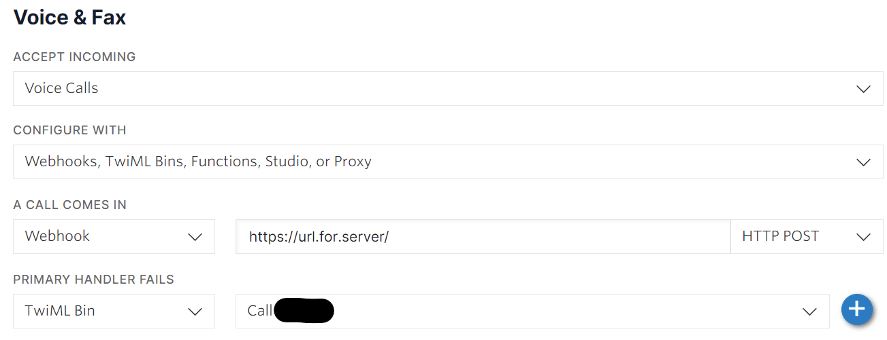

# Apartment Buzzer System

## Problem

Our apartment building only allows a single phone number to be tied to the enterphone buzzer system per unit. We don't have a landline, and wanted to both be able to receive buzzes from the front entrance on our cell phones.

## Solution

A self-hosted app utilizing Twilio to manage and direct calls from the enterphone to each of our phones. As an added bonus, it also trigger Philips Hue lights in our apartment to flash when a buzz is incoming.

## Outline

When a visitor dials your unit on the enterphone, the call will go out to the Twilio service, and will connect to the app running on your server. When the app receives a valid request originating from the Apartment Enterphone number, it will drop that call into a conference room (with hold music) while it then initiates calls out to the two tenants.

When a call one tenant is answered, the call to the other tenant is terminated, and the answered call gets dropped into the same conference room, beginning the conference. You can then speak to the visitor, and key presses get passed through to the enterphone system for remote unlocking of the door.

### Extras:

As there is a small delay from when the visitor enters the apartment number, and the tenant's phone starts ringing, I have added an integration with Philips Hue bulbs that will briefly flash the bulbs as soon as the enterphone call is received by the app. This gives a visual warning that an enterphone call is about to come through, allowing the tenant to proactively grab their phone. This was implemented after overly ambitious delivery people would prematurely hang up the call when they thought they had waited long enough.

Another extra, to make the experience as seamless as possible for the visitor, is setting the hold music for the conference room as a phone ringing sound. This means that the visitor will hear the first normal ring, a slight blip, and then ringing continuing until the tenant answers the call. This has also limited the number of pre-mature disconnections by delivery people.

## Configuration

### Dynamic DNS

For this to work, you need to be able to access your server from a static URL. You can use a dynamic DNS service like freemyip.com or duckdns.org to achieve this.

Update the `[Server]` section of the `config.ini` file with this static URL. You can also choose a port number to use.

### Twilio phone number

Next, you need a [Twilio](www.twilio.com) account and phone number. This paid service allows you to trigger events when a phone number is dialed, with very reasonable rates for this purpose. Configure the phone number on Twilio as follows, with the Webhook directed to HTTP POST your server (don't forget the trailing `/`). You can add a backup in case the server is unreachable - in my case I forward the call to my cell phone.

Lookup your account sid and auth token on your account page, and fill in the `[Twilio]` section of the `config.ini` file.

### SSL / nginx Proxy Manager

I use letencrypt for SSL, managed via nginx Proxy Manager. In order to enable SSL on this buzzer system, you will need to have the paths to the fullchain.pem and privkey.pem files for your domain. 

NPM also forward requests to the URL to the correct port on the server. If you are not using NPM, you need to append `:[PORT]/` to the end of the URL.

### Philips Hue

If you are using Philips Hue bulbs, you can have them flash when the enterphone is buzzing you. This is a visual cue before your phone starts to ring. Using the `phue` library, you first need to determine the index ID of the bulbs you want to control. Fill in the `[Hue]` section of the `config.ini` file with the Hue Bridge IP address, and the IDs of the bulbs to control.

### Ringing sound

The `.mp3` file of the sound you want to play when the enterphone enters the conference while waiting for the tenants to answer. I have this set to a standard ringing sound, as I found that visitors would get confused if the sound was different.

### Phone numbers

There are 4 phone numbers involved:

1. Your Twilio account phone number.
2. The phone number that the enterphone calls out from.
3. The phone number of tenant 1.
4. The phone number of tenant 2.

Enter all these phone numbers in the `[PhoneNumbers]` section of the `config.ini` file.

## Running the app

I have my instance now in a docker container, but it can readily be run in the background as a `cron` job at startup.

The app can be started with a simple `python3 buzzersystem.py`, and if it has started successfully, will send a text message to TENANT1.

## Troubleshooting

A common issue on startup is that the Philips Hue Bridge button must have been pressed within 30 seconds before the app started. This seems to only need to be performed for the initial startup, and system reboots maintain the pairing.

Logging information is written to `buzzerSystemOutput.log`.
